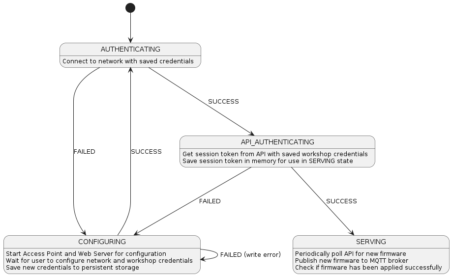

# Architecture

This document provides an overview of the architecture of the project, detailing its main components and their interactions.

## Core Components

- **State machine:** Handles the various states of the device running the firmware server, managing authentication to get access to the internet and the Citon cloud.
- **Web server:** Serves the web interface for configuring the device with WiFi credentials, API credentials and other settings.
- **API client:** Communicates with the Citon cloud to check for firmware updates and download them when available.
- **MQTT client:** Connects to the MQTT broker to receive messages and send updates about the device status.
- **Firmware manager:** Manages the firmware files, including downloading updates, verifying their integrity, matching them to the correct device and applying them to the device.

## State Machine

## Dataflow

The firmware server will periodically check the Citon cloud for firmware updates by issuing a GET request to the API. If an update is available, it will download the firmware file and verify its integrity. Once verified, it will apply the update to the device by publishing the firmware over MQTT.

